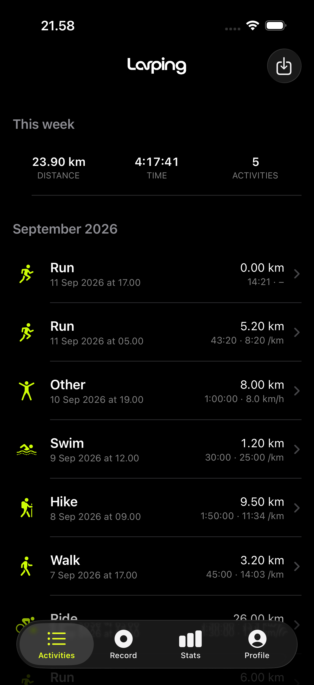
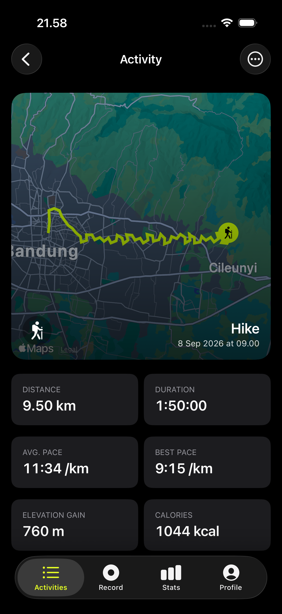
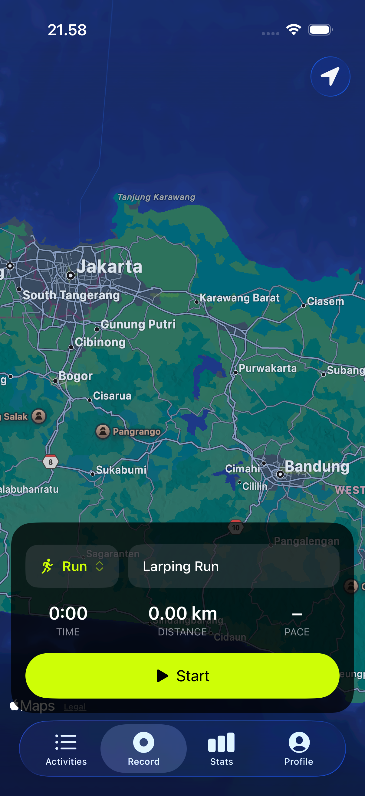

# Larping

<p align="center">
  <picture>
    <source media="(prefers-color-scheme: dark)" srcset="screenshots/logo-horizontal-dark.png">
    
  </picture>
</p>

**The offline, private Strava alternative.** Larping is a free,
open-source iOS app that records GPS activities — runs, rides, hikes, walks,
swims — on a live map, with elevation gain and pause-aware timing (a
20-minute run stays 20 minutes even if you pause in the middle). Finish
auto-saves, so there's no lost workout.

The whole thing lives on your device. **No account. No server. No ads. Zero
networking.** All data is stored on-device in SwiftData (SQLite) — nothing
ever leaves your phone. Think Strava, but just the recording, and private by
construction.

Open source, built with SwiftUI + SwiftData — no third-party
dependencies. Optional extras that keep the privacy promise: GPX import,
HealthKit sync/import (you opt in), and JSON backup/restore via iCloud Drive.
Works fully offline; GPS + Apple Maps tiles aside, the app itself never
touches the network.

## Screenshots

<p align="center">
  
  
  
</p>

## Features

- **Record** — GPS tracking (background-capable, elevation gain) with live
  map. **Finish auto-saves**; no save form, no "discard your workout" risk.
  Pause time never counts toward the saved duration, pace, or average speed —
  a 20-minute run stays 20 minutes even it you paused in the middle.
  Event name auto-fills as "Larping Run" / "Larping Run 1" / "Larping Run 2"…
  (bumps only when that name already exists) and stays editable, but is
  **required** — clear it and Start disables until you fill it back in.
  Sport picked via a compact picker beside the event field; the sport icon
  bounces while recording, and a matching sport-symbol marker rides the live
  route tip on the map (falls back to the system blue dot before you start).
  Pausing is visibly distinct (bounce stops, a red `PAUSED` capsule appears),
  and if the GPS fix degrades mid-recording a small "GPS signal weak" warning
  appears — recording still continues, points are just limited to accurate
  fixes.
  Location button lives in the nav bar (top-trailing); the map is full-bleed
  (no top nav tint — the page is fully immersive), with the dark bottom
  control card in dark mode extending down to the tab bar (only Record's tab
  bar is tinted; other tabs keep the default liquid-glass). The card floats
  above the map as a translucent black overlay in dark mode (form
  content stays legible, map shows through faintly).
- **Activities** — list header is the horizontal wordmark (no title text, no
  separate leading toolbar icon — avoids the "glass" chip iOS puts behind
  bare toolbar images); auto-refreshes via `@Query`. A "This week"
  distance/time/count strip sits above the list, and activities are grouped
  into month sections instead of one flat list; each row shows the event
  title (falls back to the sport label). Detail opens with a hero map (route
  draws itself in sync with a bouncing sport-symbol rider, event
  title + sport icon overlaid bottom-left/bottom-right), bold stat tiles
  (avg/max heart rate tiles appear when the activity has HR data), and
  an overflow (`•••`) menu for Share / **Rename event** / Delete.
- **Share** — three swipeable 1080x1920 (Instagram Story ratio) templates:
  a classic card (sport icon + wordmark up top, a big route path line +
  stats, and the date in the footer — no event title, over a photo or a
  **transparent PNG** you can paste anywhere — previewed on a black backing
  so it stays visible in light mode, exported/shared fully transparent), a
  map template (real map fills the background with the wordmark top-right
  and the sport icon top-left over it, route overlaid with start/finish flag
  markers, and a bottom info card — sized to its content, no repo URL — holding
  the event title, date, and stats), and a slow 60fps animated video of the
  route drawing in over the same map. The map template's card title is the event name exactly as
  typed (casing preserved). Pace is shown without the ` /km` unit; speed
  sports keep `km/h`. Generated videos are temporary — share/save them before
  leaving, then they're cleaned up. Shared via the system share sheet.
- **GPX import** — `.gpx` file → activity (`source: gpx_import`); the sport
  is auto-detected from the file's `<type>` element (unknown/absent keeps
  the picker default).
- **HealthKit import** — Profile "Allow HealthKit access" (read) unlocks
  Activities → Import → "Import from Health": pick a Watch/iPhone workout,
  override the sport, and bring it into Larping with route + heart rate where
  available (`source: healthkit_import`). Same graceful fallbacks as GPX — no
  route/HR means a metadata-only activity, never fabricated data.
- **Stats** — last-7-days distance chart + per-sport totals (distance, time,
  activity count, max heart rate when present), plus all-time totals and
  personal bests (longest distance, longest duration, highest heart rate).
- **Sample data** — one-time seed (7 activities, all sports, last 7 days,
  organic random-walk paths) on first install so the app isn't empty. Users
  can delete everything; it never re-seeds (`seedSampleDataV1` flag).
- **Backup** — Profile → Export all as JSON to Files/**iCloud Drive**, and
  Import backup back (idempotent — existing ids are skipped). Event names
  round-trip through backups. Profile shows when the last successful
  export/import happened.
- **HealthKit (optional)** — Profile → "Allow HealthKit access" opts in;
  after a recording finishes, the saved activity is mirrored to the Health
  app as a workout with its route. Purely additive: recording works
  identically with or without it, HealthKit never shows a prompt unless you
  ask, and a failed/denied write never blocks or loses the local save.
- **Profile** — a compact card (not a tall hero banner) with a fixed accent
  gradient (no custom cover photo) behind avatar/name/bio and a full-height
  darkening scrim so the gradient never reads as raw lime/blue, and the
  horizontal wordmark small top-trailing, always white in both light and
  dark mode. Appearance toggle is a compact icon-left/label-right control
  (System/Light/Dark), and a small version footer sits at the bottom.
- **Appearance** — light/dark/system toggle (icon picker), persisted.
- **Splash** — branded launch: the horizontal logo wordmark over the app's
  canvas background, white in dark mode / black in light mode, with a static
  same-color `UILaunchScreen` behind it (no flash between phases).

## Data

Everything lives in the SwiftData store: `CDActivity` + `CDTrackPoint`
(cascade delete). No network, no auth, no tokens. Cosmetics (display name,
bio, appearance) are `@AppStorage`.

Data lives only on this device. To keep it safe / move devices: **Profile →
Export all activities** (save the JSON in iCloud Drive / Files), then
**Profile → Import backup**. No scheduled/automatic backup yet
(`docs/KNOWN_ISSUES.md`).

## Build & verify

```bash
xcodebuild -project larping.xcodeproj -scheme larping \
  -destination 'generic/platform=iOS Simulator' -configuration Debug build \
  2>&1 | grep -Ei "error:|warning:|BUILD SUCCEEDED|BUILD FAILED"
```

Known non-code warnings that always appear (don't chase them): the
`AccentColor` asset-symbol redeclaration warning, and the
`appintentsmetadataprocessor` "no AppIntents.framework" note.

## Known limits (summary)

- Route map in detail uses Apple Maps → needs network for tiles; the recorded
  **data** is always offline.
- True background iCloud sync would need an iCloud/CloudKit entitlement
  (paid Apple Developer Program) — today it's manual export to iCloud Drive.
- Live-record notification (Dynamic Island/Lock Screen) is NOT built — needs
  a Widget Extension target, see `docs/KNOWN_ISSUES.md`.
- No Apple Watch app, no scheduled automatic backup, no HealthKit active
  energy/calories — full rationale in `docs/STATUS.md` "Next / not built".

## Documentation

- `docs/ARCHITECTURE.md` — current structure, theming, conventions
- `docs/STATUS.md` — how it got here / commit-by-commit log
- `docs/KNOWN_ISSUES.md` — known gaps and non-bugs

## Contributing

See `CONTRIBUTING.md` for setup, conventions, and PR process.

## License

This project is licensed under the [MIT License](LICENSE).